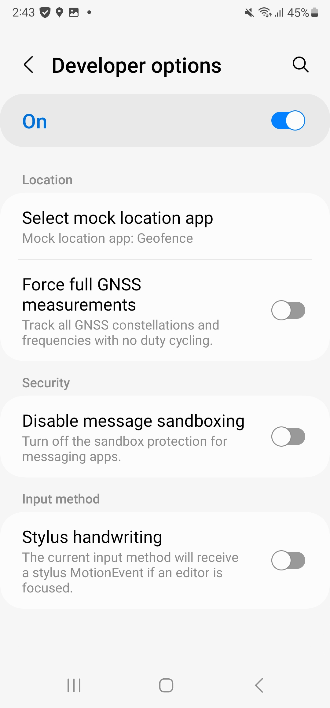
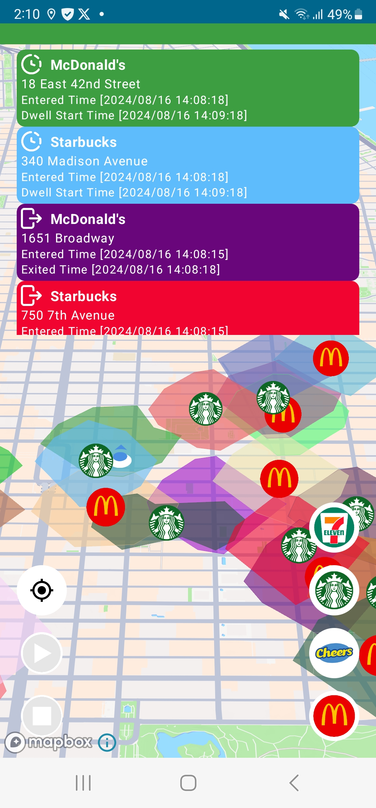

# Geofence Demo App

This repository contains a Geofence demo application built with Android and Kotlin. The app allows users to mock locations and visualize geofencing events on a map. It utilizes the Mapbox SDK and associated APIs to create a comprehensive demonstration of geofencing capabilities.

## Setup

### 1. Mock Location Configuration
To use this app, you need to set it as the mock location app in the developer settings of your Android device:
- Go to **Settings** > **Developer options**.
- Select **Mock location app** and choose this app.

## How to Use the App

1. **Moving the Current Location**  
   Long press on the map, then select "Move". This will move the current location (mock the location) to the selected point.

2. **Searching and Displaying Isochrones**  
   Click on the buttons on the right side of the screen to call the SearchBox API, which retrieves locations near the current mocked location. The results are then used to call the Isochrone API to retrieve polygons of a 3-minute walking distance, which are displayed on the map.

3. **Drawing a Walking Route**  
   Long press on the map, then select "Start" and "End" to draw a walking route between these two points. The route should intersect with the previously created polygons.

4. **Simulating Movement and Displaying Geofence Events**  
   Click on the play button on the left to start the puck moving along the route.  
   Click on the stop button to end the puck's movement.  
   When Geofence events occur, they will be displayed as panels on the screen.

## Demo Video
Watch the app in action:

[Demo Video](assets/videos/Recording.mp4)
